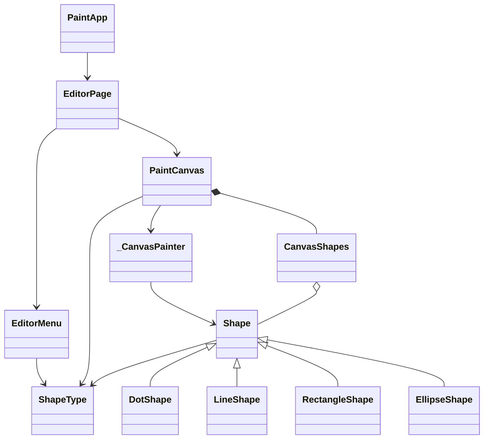

# Лабораторна робота №2. Розробка графічного редактора об'єктів

Варіант 26 (Ж = 26). Простий графічний редактор на Flutter з меню Файл / Об'єкти / Довідка.
Крапка ставиться клацанням миші, лінія, прямокутник і еліпс вводяться перетягуванням.

Параметри варіанту:
- статичний масив вказівників Shape на 126 елементів (N = Ж + 100 = 26 + 100);
- «гумовий» слід: суцільна синя лінія (26 mod 4 = 2);
- прямокутник: ввід по двом протилежним кутам (26 mod 2 = 0), чорний контур з блакитним заповненням (26 mod 5 = 1, 26 mod 6 = 2);
- еліпс: ввід від центру до одного з кутів (26 mod 2 = 0), чорний контур з білим заповненням (26 mod 5 = 1);
- позначка поточного типу об'єкта: галочкою в меню «Об'єкти» (26 mod 2 = 0).

Запуск: `flutter run -d linux`

## Діаграма класів

